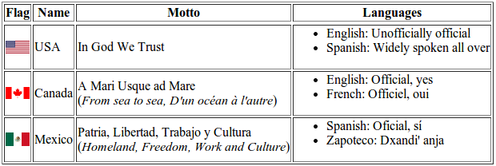

# Fun with Scala Dynamic, macros and Yaml #

```SDynamic``` is a small utility to quickly improvise untyped object literals and then treat
them as if they were Scala objects.

```scala
// Look ma: no intervening case classes!
val naftaCountries = dyaml"""
  |- { name: USA,  currency: USD, population: 313.9,
  |    motto: In God We Trust, languages: [ English ] }
  |- { name: Canada, currency: CAD, population: 34.9,
  |    motto: A Mari Usque ad Mare, languages: [ English, French ] }
  |- { name: Mexico, currency: MXN, population: 116.1,
  |    motto: 'Patria, Libertad, Trabajo y Cultura', languages: [ Spanish ] }
  """.toList
assert(naftaCountries.length == 3)
assert(naftaCountries(0).name == "USA")
assert(naftaCountries(1).population == 34.9)
assert(naftaCountries(2).motto == "Patria, Libertad, Trabajo y Cultura")
assert(naftaCountries(1).languages.toList == Seq("English", "French"))
```

The serialization language used to enunciate object graphs is [Yaml](http://en.wikipedia.org/wiki/YAML)
(in its [SnakeYaml](https://code.google.com/p/snakeyaml/) variety). Object-like property manipulation is
based on Scala's [```Dynamic```](http://www.scala-lang.org/api/2.11.2/#scala.Dynamic) trait.

The ```dyaml``` string interpolator provides a convenient notation while ensuring Yaml well-formedness
at compile-time via a simple macro.

Intellij Idea users get the added bonus of Yaml literal syntax highlighting and edit-time validation:


## Why on Earth? ##

Yeah, why? And what about type-safety? ;-)

Like many such small utilities, ```SDynamic``` was born of a personal itch to scratch. I've needed to write numerous unit
tests requiring lots of structured (but otherwise *volatile*) data.

Creating case classes nesting other case classes and then writing long object literal expressions for them quickly grows
tedious and cumbersome:

```scala
case class Country(name: String, currency: String, population: Double,
                   motto: String, languages: Seq[String])
// Wrappers, parens, quotes, commas. Oh my!
val naftaCountries = Seq(
    Country(
      name = "USA",
      currency = "UDS",
      population = 313.9,
      motto = "In God We Trust",
      languages = Seq("English")),
    Country(
      name = "Canada",
      currency = "CAD",
      population = 34.9,
      motto = "A Mari Usque ad Mare",
      languages = Seq("English", "French")),
    Country(
      name = "Mexico",
      currency = "MXN",
      population = 116.1,
      motto = "Patria, Libertad, Trabajo y Cultura",
      languages = Seq("Spanish"))
    )
```

:point_up: The astute reader will notice the above could be written sàns named parameters. For nested structures with
more than just a few fields, however, positional parameters in object literals quickly become a liability as they obscure
value-to-field attribution.

When dealing with one-off object literals we want:

- Minimal verbosity
- Maximal readability


## Why Yaml? ##

Yeah! Why not JSON? Or XML?

Let's see:


<table border="1">
  <tr>
    <th>Language</th>
    <th>Example</th>
  </tr>
  <tr>
    <td align="center"><b>Yaml</b><br>(Mkay)</td>
    <td><pre><code>- name: USA
  currency: USD
  population: 313.9
  motto: In God We Trust
  languages: [ English ]
- name: Canada
  currency: CAD
  population: 34.9
  motto: A Mari Usque ad Mare
  languages: [ English, French ]
- name: Mexico
  currency: MXN
  population: 116.1
  motto: Patria, Libertad, Trabajo y Cultura
  languages: [ Spanish ]</code></pre></td>
  </tr>
  <tr>
    <td align="center"><b>JSON</b><br>(Uff!)</td>
    <td><pre><code>[{"name": "USA",
  "currency": "USD",
  "population": 313.9,
  "motto": "In God We Trust",
  "languages": [ "English" ] },
 {"name": "Canada",
  "currency": "CAD",
  "population": 34.9,
  "motto": "A Mari Usque ad Mare",
  "languages": [ "English", "French" ] },
 {"name": "Mexico",
  "currency": "MXN",
  "population": 116.1,
  "motto": "Patria, Libertad, Trabajo y Cultura",
  "languages": [ "Spanish" ] }
]</code></pre></td>
  </tr>
  <tr>
    <td align="center"><b>XML</b><br>(Ugh!)</td>
    <td><pre><code>&lt;countries&gt;
  &lt;country&gt;
    &lt;name&gt;USA&lt;/name&gt;
    &lt;currency&gt;USD&lt;/currency&gt;
    &lt;population&gt;313.9&lt;/population&gt;
    &lt;motto&gt;In God We Trust&lt;/motto&gt;
    &lt;languages&gt;
      &lt;language&gt;English&lt;/language&gt;
    &lt;/languages&gt;
  &lt;/country&gt;
  &lt;country&gt;
    &lt;name&gt;Canada&lt;/name&gt;
    &lt;currency&gt;CAD&lt;/currency&gt;
    &lt;population&gt;34.9&lt;/population&gt;
    &lt;motto&gt;A Mari Usque ad Mare&lt;/motto&gt;
    &lt;languages&gt;
      &lt;language&gt;English&lt;/language&gt;
      &lt;language&gt;French&lt;/language&gt;
    &lt;/languages&gt;
  &lt;/country&gt;
  &lt;country&gt;
    &lt;name&gt;Mexico&lt;/name&gt;
    &lt;currency&gt;MXN&lt;/currency&gt;
    &lt;population&gt;116.1&lt;/population&gt;
    &lt;motto&gt;Patria, Libertad, Trabajo y Cultura&lt;/motto&gt;
    &lt;languages&gt;
      &lt;language&gt;Spanish&lt;/language&gt;
    &lt;/languages&gt;
  &lt;/country&gt;
&lt;/countries&gt;</code></pre></td>
  </tr>
</table>

Yaml minimizes punctuation while enhancing readability:

- No need to enclose property values or (the horror!) *property names* in quotation marks
- No need to separate list elements with commas or enclosing lists in brackets when using multi-line mode
- No need to verbosely mark the beginning and end of each property

Additionally, SnakeYaml makes it possible to insert "true" objects that can then be referenced in code:

```yaml
name: Vatican
languages: [ Latin, Italian ]
president: !!net.xrrocha.example.Person # Look ma: an old-fashioned Java bean
  firstName: Jorge
  middleName: Mario
  lastName: Bergolio
  nomeDeGuerre: Francisco
```

# Example #

The example below builds the following HTML content:



```scala
object Example extends App {
  import DYaml._

  val countries = dyaml"""
    |- name: USA
    |  currency: USD
    |  population: 313.9
    |  motto: In God We Trust
    |  languages: [ English ]
    |  flag: http://upload.wikimedia.org/wikipedia/en/thumb/a/a4/Flag_of_the_United_States.svg/30px-Flag_of_the_United_States.svg.png
    |- name: Canada
    |  currency: CAD
    |  population: 34.9
    |  motto: |
    |    A Mari Usque ad Mare<br>
    |    (<i>From sea to sea, D'un océan à l'autre</i>)
    |  languages: [ English, French ]
    |  flag: http://upload.wikimedia.org/wikipedia/en/thumb/c/cf/Flag_of_Canada.svg/30px-Flag_of_Canada.svg.png
    |- name: Mexico
    |  currency: MXN
    |  population: 116.1
    |  motto: |
    |    Patria, Libertad, Trabajo y Cultura<br>
    |    (<i>Homeland, Freedom, Work and Culture</i>)
    |  languages: [ Spanish ]
    |  flag: http://upload.wikimedia.org/wikipedia/commons/thumb/f/fc/Flag_of_Mexico.svg/30px-Flag_of_Mexico.svg.png
  """.toList

  import Html._
  def country2Html(country: SDynamic) = html"""
          |<tr>
          |  <td></td>
          |  <td>${country.name}</td>
          |  <td>${country.motto}</td>
          |  <td>${country.languages.toList mkString ", "}</td>
          |</tr>
        """

  val pageHtml = html"""
          |<html>
          |<head><title>NAFTA Countries</title><meta charset="UTF-8"></head>
          |<body>
          |<table border='1'>
          |<tr>
          |  <th>Flag</th>
          |  <th>Name</th>
          |  <th>Motto</th>
          |  <th>Languages</th>
          |</tr>
          |<tr>${(countries map country2Html).mkString}</tr>
          |</table>
          |</body>
          |</html>
        """

  val out = new java.io.FileOutputStream("src/test/resources/countries.html")
  out.write(pageHtml.getBytes("UTF-8"))
  out.flush(); out.close()
}

// Added bonus to have IntelliJ highlight and validate HTML islands
object Html {
  implicit class HtmlString(val sc: StringContext) extends AnyVal {
    def html(args: Any*) = sc.s(args: _*).stripMargin.trim
  }
}
```

 